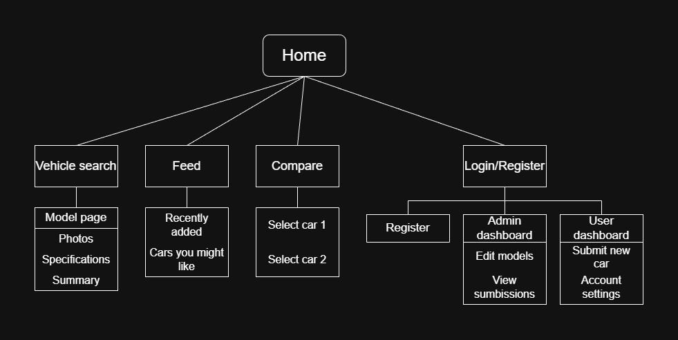

# CarWiki — Personas, Information Architecture & Sitemap
---

## 1) Personas

| Persona | Photo | Basic (age / location / role) | Wants (what kind of site) | Primary device |
|---|---|---|---|---|
| Marko |  | 34 / Zagreb / Engineer & classic-car restorer | Accurate technical specs, comparisons, ability to add detailed entries (admin verification) | Desktop (large monitor)
| Ana |  | 27 / Split / Digital marketer, car buyer | Quick comparisons, concise reviews, visually rich (photos/videos) | Mobile (iPhone) / Laptop   
| Ivan |  | 52 / Osijek / Car dealer (used cars) | Fast access to key specs and equipment packs, simple UI for lookup | Laptop / Android phone |

---

## 2) Information Architecture

| Section | Path | Notes |
|---|---|---|
| Home | / | Public — search + car picker + feed |
| Browse | /browse | Make → Model → Generation |
| Compare | /compare | Select two cars |
| Add Vehicle | /account/add-vehicle | Protected — login required (CTA visible to guests) |
| User dashboard | /dashboard | Add Vehicle, Manage account |
| Admin | /admin | Protected, Moderation, submissions |
| Help | /about | FAQ / contact |
| Footer | (site-wide) | Privacy / Terms / Social |

---

## 3) Sitemap

---

